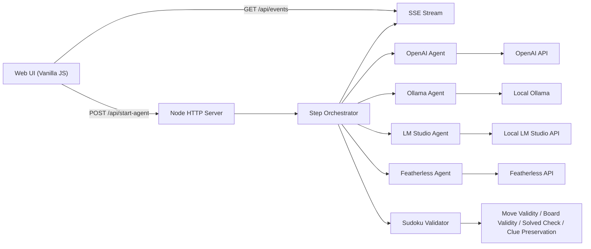

# AI Sudoku Agent Race

A production-style Node.js project where multiple AI providers compete on the same Sudoku puzzle, with strict validation, resilient orchestration, and both CLI + visual web UI.

## What This Project Demonstrates

- Multi-agent architecture over heterogeneous providers:
  - OpenAI (official SDK)
  - Ollama (local runtime)
  - LM Studio (OpenAI-compatible local runtime)
  - Featherless (OpenAI-compatible cloud endpoint)
- A shared agent contract for interchangeable providers.
- Strict JSON-only AI outputs with defensive parsing.
- Step-based orchestration that tolerates model mistakes and keeps going.
- Live visual comparison of providers, including:
  - attempts
  - invalid move count
  - timeout count
  - final status

## Tech Stack

- Runtime: Node.js 20+
- Module system: ESM (`"type": "module"`)
- Networking: native `fetch`
- OpenAI provider: official `openai` npm package
- Web UI server: native `http` (no framework dependency)
- Frontend: vanilla HTML/CSS/JS
- Streaming updates: Server-Sent Events (SSE)

## Architecture



### Folder Structure

```text
.
├── agents/
│   ├── BaseAgent.js
│   ├── OpenAIAgent.js
│   ├── OllamaAgent.js
│   ├── LMStudioAgent.js
│   ├── FeatherlessAgent.js
│   ├── OpenAICompatibleAgent.js
│   └── index.js
├── core/
│   ├── config.js
│   ├── env.js
│   ├── orchestrator.js
│   ├── puzzles.js
│   └── sudoku.js
├── utils/
│   ├── format.js
│   ├── json.js
│   └── timer.js
├── web/
│   ├── index.html
│   ├── styles.css
│   └── app.js
├── index.js
├── server.js
├── .env.example
├── .gitignore
├── package.json
└── README.md
```

## Core Concepts

### 1. Agent Contract

Every provider implements the same contract:

- `name`
- `solve(board, mode)`

Supported modes:

- `full` -> returns full solved board
- `step` -> returns one move (`row`, `col`, `value`)

### 2. Strict AI Output Format

Expected full response:

```json
{
  "solution": [[5,3,4,6,7,8,9,1,2], [6,7,2,1,9,5,3,4,8], [1,9,8,3,4,2,5,6,7], [8,5,9,7,6,1,4,2,3], [4,2,6,8,5,3,7,9,1], [7,1,3,9,2,4,8,5,6], [9,6,1,5,3,7,2,8,4], [2,8,7,4,1,9,6,3,5], [3,4,5,2,8,6,1,7,9]]
}
```

Expected step response:

```json
{
  "row": 0,
  "col": 2,
  "value": 4
}
```

Any non-JSON or malformed shape is rejected.

### 3. Validation Pipeline

Each candidate move/board is checked for:

- board shape correctness
- Sudoku row/column/subgrid constraints
- preserving original puzzle clues
- solved-state correctness

### 4. Fault-Tolerant Step Runner

The step orchestrator now:

- continues after invalid moves
- counts invalid moves
- treats timeouts as retryable
- counts timeouts
- emits per-step events via SSE to the UI

## Setup

1. Install dependencies:

```bash
npm install
```

2. Create env file:

```bash
cp .env.example .env
```

3. Fill required keys/endpoints in `.env`.

Notes:
- `.env` is loaded automatically at startup.
- `.env` values override shell exports.

## Running

### CLI

```bash
npm start
```

Step-focused mode:

```bash
npm run start:step
```

### Web UI

```bash
npm run start:web
```

Then open [http://localhost:3000](http://localhost:3000).

## Web UI Features

- Left sidebar with global actions and metadata
- Footer links:
  - Built By Harish Kotra
  - Checkout my other builds
- Two-row provider layout:
  - Local Models (Ollama, LM Studio)
  - Third-Party Models (OpenAI, Featherless)
- Two columns per row on desktop, one column on mobile
- Per-provider model configuration:
  - auto-detect dropdown for Ollama/LM Studio
  - manual model input for OpenAI/Featherless
- Per-provider timeout override
- Live counters: attempts, invalid moves, timeouts

## Environment Variables

### General

- `SOLVE_MODE=full|step`
- `PUZZLE_LEVEL=easy|medium`
- `AGENT_TIMEOUT_MS=30000`
- `AGENT_RETRIES=2`
- `MAX_STEP_COUNT=150`
- `STEP_DELAY_MS=350`
- `VERBOSE_LOGS=true|false`

### Web

- `WEB_PORT=3000`

### OpenAI

- `OPENAI_API_KEY`
- `OPENAI_MODEL=gpt-4o-mini`

### Ollama

- `ENABLE_OLLAMA=true|false`
- `OLLAMA_BASE_URL=http://127.0.0.1:11434`
- `OLLAMA_MODEL=gemma4:latest`

### LM Studio

- `ENABLE_LMSTUDIO=true|false`
- `LMSTUDIO_BASE_URL=http://127.0.0.1:1234/v1`
- `LMSTUDIO_API_KEY=lm-studio`
- `LMSTUDIO_MODEL=local-model`

### Featherless

- `FEATHERLESS_API_KEY`
- `FEATHERLESS_BASE_URL=https://api.featherless.ai/v1`
- `FEATHERLESS_MODEL=featherless-chat`

## API Surface (Web Server)

- `GET /api/providers` -> provider metadata + detected models
- `GET /api/provider-models?providerId=...` -> refresh model list for local providers
- `POST /api/start-agent` -> start provider run with model/timeout
- `GET /api/events?runId=...` -> SSE event stream
- `GET /api/health` -> basic health info

Example run start payload:

```json
{
  "providerId": "ollama",
  "model": "gemma4:latest",
  "timeoutMs": 180000
}
```

## Useful Code Snippets

### Provider-agnostic step run invocation

```js
await runAgentStepwise({
  agent,
  puzzle,
  timeoutMs,
  retries,
  maxSteps,
  stepDelayMs,
  maxTimeouts: 6,
  onEvent,
});
```

### SSE wiring (server side)

```js
res.writeHead(200, {
  "Content-Type": "text/event-stream",
  "Cache-Control": "no-cache",
  Connection: "keep-alive",
});
```

### Strict JSON parsing guard

```js
if (!text.startsWith("{") || !text.endsWith("}")) {
  return { ok: false, error: "Response is not strict JSON object text." };
}
```

## Contributing

### Fork and Contribute Workflow

1. Fork this repo on GitHub.
2. Clone your fork.
3. Create a feature branch.
4. Implement + test locally.
5. Open a PR with:
   - what changed
   - why it changed
   - screenshots or logs for behavior changes

Suggested git flow:

```bash
git clone https://github.com/<your-username>/<repo-name>.git
cd <repo-name>
git checkout -b feat/your-feature
# make changes
npm install
npm run start:web
git add .
git commit -m "feat: add ..."
git push origin feat/your-feature
```

### Contribution Guidelines

- Keep provider logic isolated in `agents/`.
- Keep core game/orchestration in `core/`.
- Avoid introducing heavy dependencies without strong reason.
- Preserve strict output validation guarantees.
- Document new config knobs in `.env.example` and README.

## Feature Ideas / Roadmap

- Add persistent run history with SQLite.
- Add per-provider prompt templates editable from UI.
- Add tournament mode across multiple puzzles and aggregate scorecards.
- Add websocket support for richer real-time UX.
- Add deterministic fallback solver for baseline comparison.
- Add Docker setup for one-command local demo.
- Add unit/integration tests (Vitest/Jest) for validators and orchestrator.
- Add CI workflows for lint/test.

## Security Notes

- Never commit `.env`.
- Rotate leaked API keys immediately.
- Treat model outputs as untrusted input; keep validation strict.