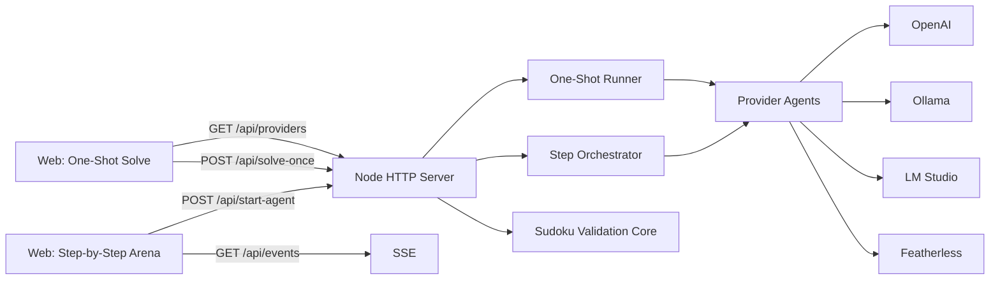

# Agentoku - AI Sudoku Arena (V2)

Agentoku is a Node.js app for benchmarking LLM providers on Sudoku under strict validation.

This README documents the **v2 upgrade** on top of yesterday’s v1 build.


## What changed in V2 (incremental)

V1 delivered:
- step-by-step multi-provider Sudoku race
- robust validation and retry handling
- live web UI + SSE event stream

V2 adds:
- **One-Shot Solve page** (`/one-shot`) for full-board solving in a single call
- **single board UX** (pick provider + model + run once)
- **runtime API key input** for OpenAI/Featherless (so they are usable even if env key missing)
- **cost-optimized prompt** for one-shot/full mode (shorter prompt, lower token footprint)
- optional **token/cost estimate panel** (toggle hidden by default)

## Screens and Flows

### Step-by-step Arena (V1)
- URL: `/`
- Providers run move-by-move
- Tracks attempts, invalid moves, timeouts

### One-Shot Solve (V2)
- URL: `/one-shot`
- User selects one provider + model
- Sends full board once, expects full solution once
- Validates entire response server-side

## Tech Stack

- Node.js 20+ (ESM)
- Native `http` server (no framework)
- Native `fetch`
- OpenAI SDK (`openai` package)
- Vanilla HTML/CSS/JS
- SSE for live streaming on step-by-step page

## Architecture (V2)



## Folder Structure

```text
.
├── agents/
│   ├── BaseAgent.js
│   ├── OpenAIAgent.js
│   ├── OpenAICompatibleAgent.js
│   ├── OllamaAgent.js
│   ├── LMStudioAgent.js
│   ├── FeatherlessAgent.js
│   └── index.js
├── core/
│   ├── config.js
│   ├── env.js
│   ├── orchestrator.js
│   ├── puzzles.js
│   └── sudoku.js
├── utils/
│   ├── json.js
│   ├── timer.js
│   └── format.js
├── web/
│   ├── index.html
│   ├── app.js
│   ├── one-shot.html
│   ├── one-shot.js
│   └── styles.css
├── server.js
├── index.js
├── .env.example
├── .gitignore
├── package.json
└── README.md
```

## Setup

```bash
git clone https://github.com/harishkotra/agentoku.git
cd agentoku
npm install
cp .env.example .env
```

Run web app:

```bash
npm run start:web
```

- Step-by-step arena: `http://localhost:3000/`
- One-shot page: `http://localhost:3000/one-shot`

## Provider Configuration

### Local providers
- Ollama and LM Studio model lists are auto-discovered.

### OpenAI and Featherless (V2)
- If env key exists, provider runs normally.
- If env key is missing, one-shot page allows runtime API key input.

## API Endpoints

- `GET /api/providers`
- `GET /api/provider-models?providerId=<id>`
- `POST /api/start-agent` (step-by-step)
- `GET /api/events?runId=<id>`
- `POST /api/solve-once` (V2 one-shot)
- `GET /api/health`

### Example: one-shot request

```json
{
  "providerId": "openai",
  "model": "gpt-4o-mini",
  "timeoutMs": 30000,
  "apiKey": "sk-..."
}
```

## Cost Optimization in V2

V2 reduced prompt overhead for full-board solve.

### Before (v1 style)
- longer narrative instructions
- more tokens consumed per full request

### After (v2 compact prompt)

```js
return [
  "Solve Sudoku. Strict JSON only.",
  "Rules: digits 1-9; each row/col/3x3 has 1-9 exactly once; never change non-zero clues.",
  'Return exactly: {"solution":[[9x9 integers]]}',
  "No markdown, no extra keys/text.",
  "Board:",
  safeStringify(board),
].join("\n");
```

### Why this helps
- lower prompt tokens
- less repeated instruction overhead
- improved suitability for one-shot testing and cost comparisons

## Validation and Safety Guarantees

Every one-shot response is validated for:
- correct 9x9 shape
- clue preservation
- row/column/3x3 validity
- fully solved board

## Contributing

### Fork workflow

```bash
git clone https://github.com/harishkotra/agentoku.git
cd agentoku
git checkout -b feat/my-change
npm install
npm run start:web
```

Then:
1. Commit with clear messages
2. Push branch
3. Open PR with screenshots/logs for UI or behavior changes

### Contribution guidelines
- Keep provider-specific logic inside `agents/`
- Keep Sudoku/rules logic in `core/`
- Preserve strict JSON output contracts
- Preserve/extend validation, never weaken it
- Update README/docs for user-facing behavior changes

## Good V3 feature ideas

- Persist run history and comparisons (SQLite)
- Multi-puzzle tournament mode and ELO ranking
- Prompt templates per provider in UI
- CI pipeline with orchestrator/validator tests
- Exportable benchmark reports (JSON/CSV)
- Adaptive retry policy based on provider latency

## Security notes

- Never commit `.env`
- Rotate leaked API keys immediately
- Treat all model outputs as untrusted until validated